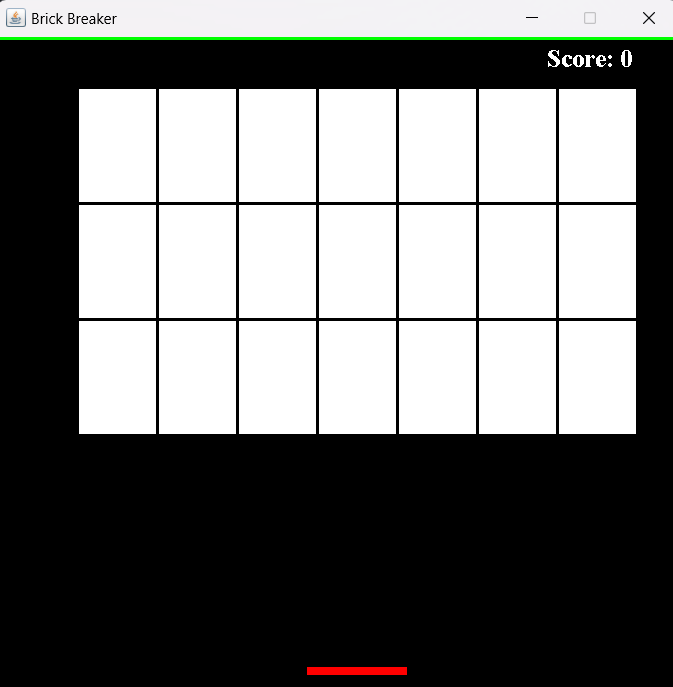
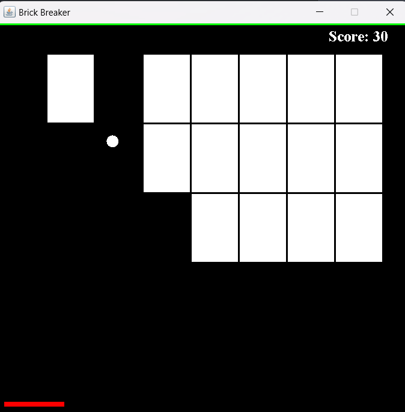
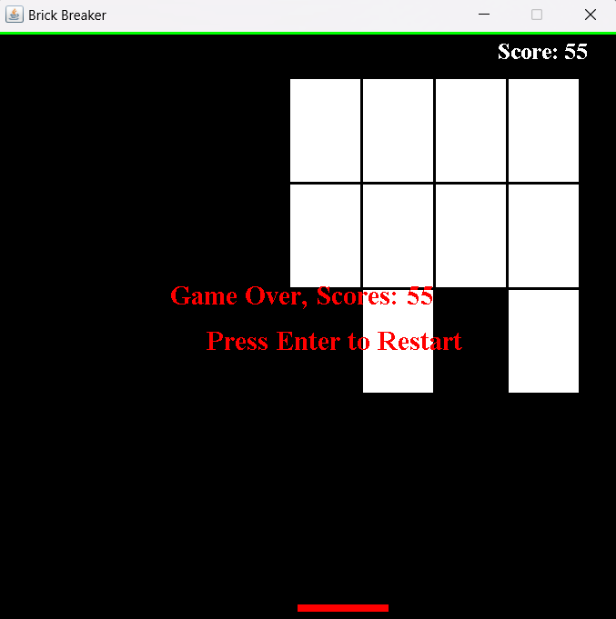
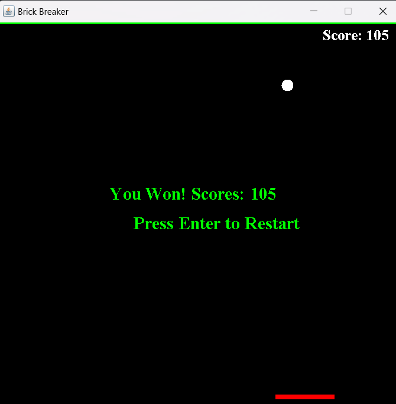

# Brick Breaker Game

Brick Breaker is a simple Java-based 2D arcade game where players control a paddle to bounce a ball and break bricks. The game ends when the player clears all the bricks or loses the ball.

## Features

- Responsive gameplay with paddle movement and ball physics
- Multiple rows and columns of bricks to break
- Tracks the player's score
- Displays "Game Over" or "You Won" messages with options to restart
- Clean and simple user interface using **Swing** for graphics

## Technologies Used

- **Java**: Core programming language
- **Swing**: For graphical user interface (GUI) elements
- **AWT**: For rendering 2D graphics

## Project Structure

```
📂 src/
├── App.java               # Main class that initializes the JFrame and starts the game
├── Gameplay.java          # Handles game logic, key events, and rendering
├── MapGenerator.java      # Generates the brick layout and handles brick rendering
📂 bin/                    # Compiled `.class` files (auto-generated after build)
📂 lib/                    # (Optional) External libraries (if used)
📄 README.md               # Project documentation
```

## Setup and Installation

### Requirements

- Java Development Kit (**JDK**) 8 or higher
- Any IDE that supports Java (e.g., IntelliJ IDEA, Eclipse, or VS Code)
- A terminal/command prompt for compilation and execution

### Steps to Run

1. **Clone the repository**:

```bash
git clone https://github.com/Parth-243/Java-Project-Simple-Brick-breaker-game-.git
cd brick-breaker-game/src
```

2. **Compile the code**: Run the following command in the `src` directory:

```bash
javac *.java
```

3. **Run the game**:

```bash
java App
```

4. Alternatively, open the project in an IDE and run the `App` class.

## How to Play

1. Use the **left** and **right arrow keys** to move the paddle
2. Bounce the ball to break bricks
3. Earn **5 points** for every brick you break
4. The game ends when:
   - You clear all the bricks (win)
   - The ball falls below the paddle (game over)

## Controls

Key Action
`←` Move paddle left
`→` Move paddle right
`Enter` Restart the game

## Game Rules

1. The ball bounces off walls, the paddle, and bricks
2. If the ball hits the paddle, its direction changes based on where it lands
3. Breaking all the bricks wins the game
4. If the ball falls below the paddle, the game ends

## Gameplay Screenshots

### Main Game Screen


_Initial game screen with full set of bricks_

### Mid-Game


_Game in progress with some bricks broken_

### Game Over


_Game over screen when ball is lost_

### Victory Screen


_Victory screen after clearing all bricks_

## Improvements for Future

- Add multiple levels with increasing difficulty
- Add power-ups like paddle extensions, multi-ball, etc.
- Implement mouse control for paddle movement
- Add sound effects and background music
- Create a scoring leaderboard

## Contributing

If you'd like to contribute, feel free to fork the repository and submit a pull request. Suggestions and bug reports are also welcome!

## License

This project is licensed under the **MIT License**. Feel free to use and modify it as you see fit.
